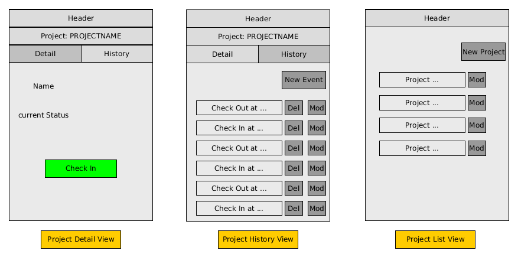

# Time Tracker #

## Description ##

Service to track and calculate the times spent on various projects

## Wireframes ##

### Project Detail View ###

* "Projectname" sub-header: Button, on click: selection:

    1. all projects (project list view)
    2. selection of open projects (color difference open / active)

* "History" tab: Button, switches to project history view
* Name and status: Information about the project
* Check-In: Button to either check-in or check-out, depending on cuzrrent status. changes color depending on current status.

### Project History View ###

* "Projectname" sub-header: Button, on click: selection:

    1. all projects (project list view)
    2. selection of open projects (color difference open / active)

* "Detail" tab: Button, switches to project details view
* Button "New Event" -> creates new check-in or check-out event
* List of Events and their datetime, sorted by time asc, color tells about whether it is a check-in or check-out, buttons to delete or modify
* between check-in and check-out, display the duration

### Project List View ###

* button to create new project
* list of projects with a button to modify the project (change name, status)
* each project is a button that brings the user to the according project detail view
* color tells whether project is active / open / closed

## Entities ##

* Project
  * name
  * clientname
  * status (active / open / closed)

* Event
  * project (FK)
  * timestamp
  * code (ENUM CHECK_IN / CHECK-OUT)
  * note (text)

## Actions ##

* list all projects, returns project list with name, id status and last event
* get project details, returns project details and complete list of events
* change project, changes name, clientname, status
* change event: changes time, code, note of a single event. on save, validates:
  * all events must be alternating check-in /out
  * not too long work time
* add project
* add event
* delete event
* delete project only if there are no events, otherwise warning that project can not be deleted
* time based reporting

## API ##

* GET /projects (with status filters in querystring)
* POST /projects
* DELETE /projects
* GET /projects/123/
* PUT /projects/123/
* GET /projects/123/events
* POST /projects/123/events
* GET /projects/123/events/456/
* PUT /projects/123/events/456/
* DELETE /projects/123/events/456/
* GET /reports/projects/123
* GET /reports/date/YYYY-MM

## Future ##

* add invoice creation
  * need more information about clients
  * other static data for invoices
  * invoice items that are not time based
  * see pdfwriter.go file for pdf creation

